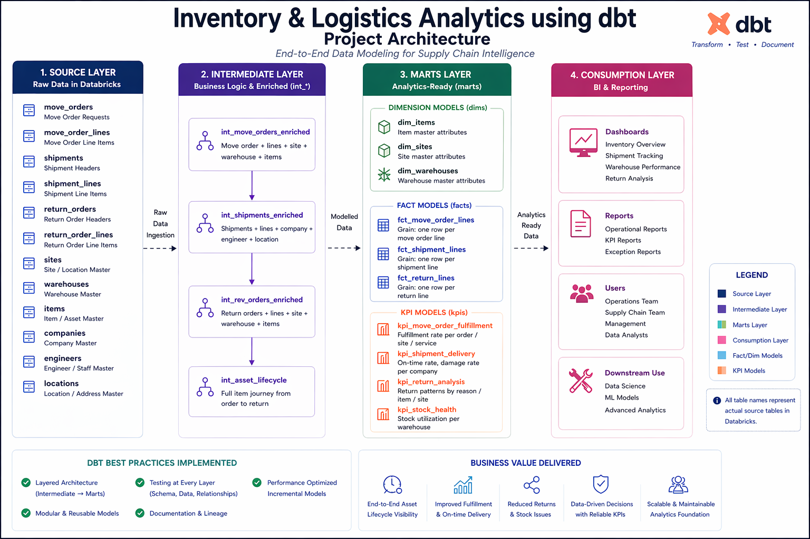

# 🚀 Inventory & Logistics Analytics using dbt

### End-to-End Supply Chain Data Modeling Project

A production-style dbt project that models **inventory movement, shipments, returns, and asset lifecycle** into analytics-ready datasets.

---

## 🔥 Project Overview

This project simulates a **real-world supply chain system**, transforming raw operational data into structured analytics models.

It enables:

* 📦 Inventory tracking across warehouses
* 🚚 Shipment and delivery analysis
* 🔁 Return order insights
* 🔍 End-to-end asset lifecycle visibility

---

## 🏗️ Architecture

<p align="center">
  
  <br>
  <em>End-to-End dbt Architecture for Inventory & Logistics Analytics</em>
</p>

### 📌 Flow

* **Source Layer** → Raw operational tables
* **Intermediate Layer** → Business logic & enrichment
* **Marts Layer** → Fact, dimension & KPI models
* **Consumption Layer** → Reporting & analytics

---

## ⚙️ Tech Stack

* dbt (data build tool)
* SQL
* Databricks (Delta Lake)
* ELT data modeling approach

---

## 📂 Project Structure

```
models/
├── intermediate/
│   ├── int_move_orders_enriched.sql
│   ├── int_shipments_enriched.sql
│   ├── int_rev_orders_enriched.sql
│   └── int_asset_lifecycle.sql
│
└── marts/
    ├── dims/
    │   ├── dim_items.sql
    │   ├── dim_sites.sql
    │   └── dim_warehouses.sql
    │
    ├── facts/
    │   ├── fct_move_order_lines.sql
    │   ├── fct_shipment_lines.sql
    │   └── fct_return_lines.sql
    │
    └── kpis/
        ├── kpi_move_order_fulfillment.sql
        ├── kpi_shipment_delivery.sql
        ├── kpi_return_analysis.sql
        └── kpi_stock_health.sql
```

---

## 🔄 Data Modeling Approach

### 🔹 Intermediate Layer (Business Logic)

* `int_move_orders_enriched`
  → Combines move orders, lines, sites, warehouses, and items

* `int_shipments_enriched`
  → Enriches shipments with company, engineer, and location

* `int_rev_orders_enriched`
  → Return orders enriched with warehouse and item details

* `int_asset_lifecycle`
  → Tracks complete item journey (order → shipment → return)

---

### 🔹 Marts Layer

#### 📊 Dimension Models

* `dim_items` → Product attributes
* `dim_sites` → Site hierarchy
* `dim_warehouses` → Warehouse metadata

#### 📦 Fact Models (Grain Defined)

* `fct_move_order_lines` → One row per move order line
* `fct_shipment_lines` → One row per shipment line
* `fct_return_lines` → One row per return line

#### 📈 KPI Models

* `kpi_move_order_fulfillment` → Fulfillment rate by order / site / service
* `kpi_shipment_delivery` → On-time delivery & damage rate
* `kpi_return_analysis` → Return trends by reason / item / site
* `kpi_stock_health` → Warehouse stock utilization

---

## 🧪 Data Quality & Testing

Implemented **dbt tests across source and model layers** to ensure data reliability.

### 🔹 Test Types

* `not_null` → Mandatory field validation
* `unique` → Primary key enforcement
* `relationships` → Referential integrity
* `accepted_values` → Business rule validation

---

### 🔹 Example

```yaml
- name: shipments
  columns:
    - name: shipment_id
      tests:
        - unique
        - not_null

    - name: shipment_type
      tests:
        - accepted_values:
            values: ['FORWARD', 'REVERSE']
```

---

### 🔹 Coverage

* Source tables validated for **data integrity**
* Fact tables validated for **correct grain**
* Relationships enforced across:

  * Orders ↔ Requests
  * Shipments ↔ Shipment Lines
  * Items ↔ Inventory

---

### 🔹 Run Tests

```
dbt test
```

---

## 📊 Business Insights Enabled

* Inventory movement across warehouses
* Shipment performance & delivery efficiency
* Return pattern analysis
* Asset lifecycle tracking
* KPI-driven supply chain monitoring

---

## ⚡ How to Run

```
dbt run
dbt test
```

(Optional)

```
dbt docs generate
dbt docs serve
```

---

## 💼 Resume Highlights

* Built an **end-to-end supply chain analytics system using dbt**
* Designed **modular intermediate models for business logic abstraction**
* Implemented **fact & dimension modeling with defined grain**
* Applied **data quality testing using dbt (schema + business rules)**
* Developed **KPI layer for analytics and reporting**

---

## 🧠 Key Learnings

* Data modeling for inventory & logistics systems
* Designing scalable dbt architectures
* Implementing data quality validation
* Translating business requirements into analytics models

---

## 🚀 Future Enhancements

* Add incremental models
* Expand test coverage for marts
* Build dashboards (Power BI / Tableau)
* Add orchestration (Airflow / Databricks Jobs)

---

## ⭐ Support

If you found this useful:

* ⭐ Star the repo
* Share with your network
* Connect on **LinkedIn**

---

## 🔥 Final Note

This project demonstrates how **modern data teams design scalable analytics systems using dbt** to transform raw operational data into actionable insights.
